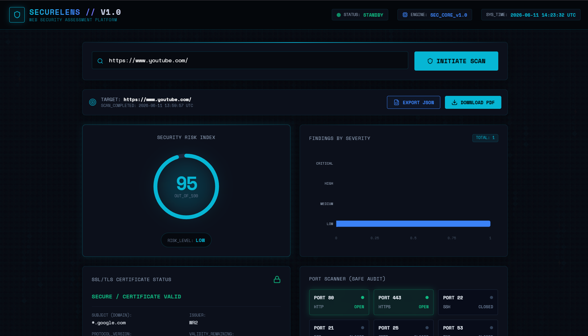
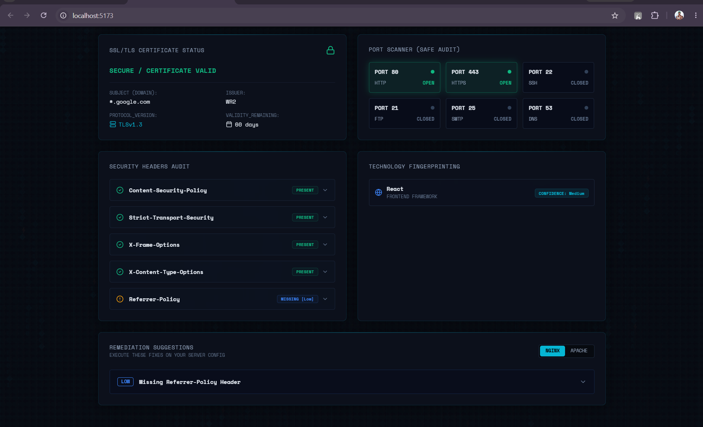

# SecureLens // Web Security Assessment Platform

SecureLens is a portfolio-grade, professional web security scanner and dashboard designed for defensive analysis and educational audits. It probes target servers for security headers, SSL/TLS handshake metadata, exposed technology footprints, and common ports using safe, non-intrusive connection checks, presenting findings in a cyberpunk-inspired SOC (Security Operations Center) dashboard.

---

## 📸 Screenshots




---

## ⚡ Core Features

1. **Passive URL Scanner**: Validates targets and requests headers without intrusive exploit payloads.
2. **Security Header Analyzer**: Checks CSP, HSTS, X-Frame-Options, X-Content-Type-Options, and Referrer-Policy.
3. **SSL/TLS Inspector**: Analyzes validity, issuer details, expiry logs, and protocol handshakes.
4. **Safe Port Prober**: Scans standard port bindings: `80` (HTTP), `443` (HTTPS), `22` (SSH), `21` (FTP), `25` (SMTP), and `53` (DNS).
5. **Technology Fingerprinter**: Inspects server and response headers/HTML signatures for React, WordPress, Nginx, Apache, PHP, and Cloudflare.
6. **Risk Scoring Engine**: Deducts points for security lapses, mapping score (0-100) to severity warnings.
7. **SOC Log Timeline**: Real-time terminal feed simulating automated scanning phases.
8. **Professional PDF Report**: Downloads a fully styled, printable vulnerability assessment report.
9. **Structured JSON Export**: Exports raw, machine-readable scan data.

---

## 🛠️ Setup & Running Instructions

### 1. Start the Backend (FastAPI)

1. Navigate to the `backend` folder:
   ```bash
   cd backend
   ```
2. Create a virtual environment and activate it:
   * **Windows (PowerShell)**:
     ```powershell
     python -m venv venv
     # If script execution is disabled on your system:
     Set-ExecutionPolicy -ExecutionPolicy RemoteSigned -Scope Process
     .\venv\Scripts\Activate.ps1
     ```
   * **Linux / macOS**:
     ```bash
     python3 -m venv venv
     source venv/bin/activate
     ```
3. Install dependencies:
   ```bash
   pip install -r requirements.txt
   ```
4. Start the backend server:
   ```bash
   python run.py
   ```
   *The backend will boot on `http://localhost:8000`.*

### 2. Start the Frontend (Vite + React)

1. Navigate to the `frontend` folder:
   ```bash
   cd frontend
   ```
2. Install npm packages:
   ```bash
   npm install
   ```
3. Run the Vite development server:
   ```bash
   npm run dev
   ```
   *The frontend will boot on `http://localhost:5173`.*

---

## 🚀 Future Roadmap

* **Subdomain Enumeration**: Passive lookup of subdomains using public APIs and DNS records.
* **Active Port Scanner**: Option to scan custom port ranges beyond standard bindings.
* **Continuous Monitoring Cron**: Set up recurring schedule scans and trigger alert webhooks/emails.
* **OAuth2 Authentication**: Allow multi-tenant user access to persist historical scans.
* **Integrations**: Enforce deeper OSINT lookups using Shodan, Censys, and HaveIBeenPwned.
* **Custom Remediation Recommendations**: Generate custom code fixes and instructions for specific header vulnerabilities.

---

## ⚖️ Legal & Safety Disclaimer

> [!WARNING]
> SecureLens is designed exclusively for educational, defensive, and authorized vulnerability assessments. It uses non-intrusive socket connections and HTTP headers analysis. No intrusive port scans, payloads, or exploit injections are carried out. Ensure you have authorization before performing scans.
